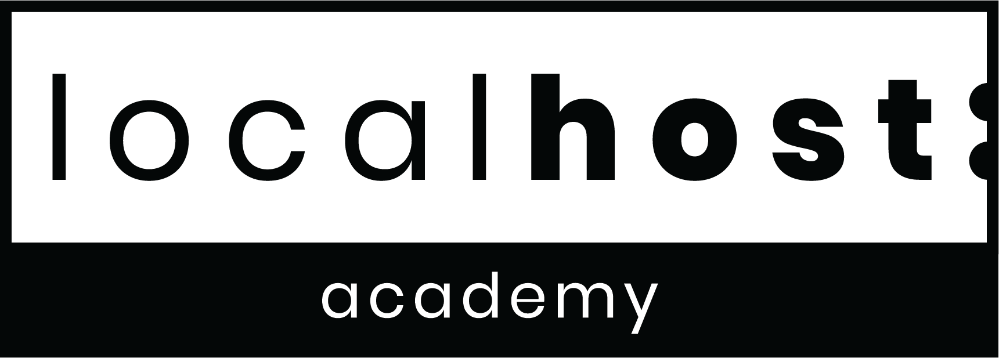
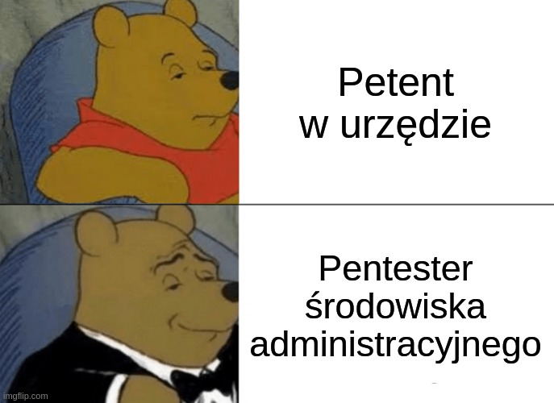
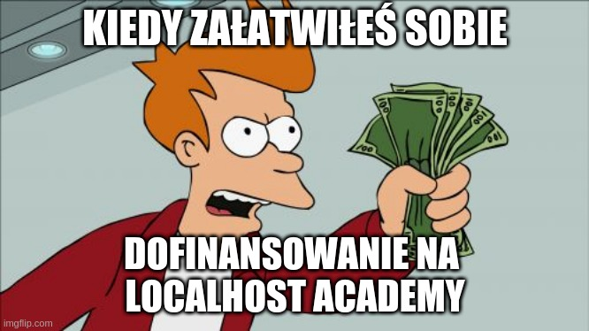
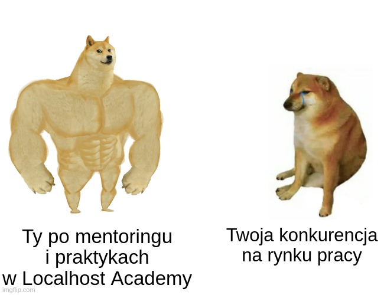

#### [TLDR] - To repozytorium to instrukcja działań z Urzędami Pracy w celu zdobycia dofinansowania na mentorski kurs indywidualny w Localhost Academy 

***
## Celem tego repozytorium jest uzbrojenie Cię w proces wypracowywania dofinansowania w Twoim przypadku w Twoim Urzędzie Pracy. Każdy urząd trochę inaczej realizuje dofinansowania i bony i na różnych warunkach

##### Także powiedz nam jak to Urząd robi u Ciebie, a my postaramy się przygotować dla Ciebie możliwie bezkosztowy kurs w zależności od różnych opcji



##### Zostań "Pentester środowiska administracyjnego" i skutecznie zdobądź finansowanie na swój dalszy rozwój indywidualny pod okiem mentora
***

# Etap 0. Kiedy warto się starać o dofinansowanie:


- **jesteś gotów uczyć się kilka godzin dziennie intensywnie ponad 9 msc, aby Twoje umiejętności realną zyskały wartość rynkową na 2021**
- masz status osoby bezrobotnej i jesteś zarejestrowany w swoim Urzędzie Pracy
- nie wykorzystałeś/-aś **jeszcze wszystkich** możliwości dofinansowania kursów
  - dofinansowanie na szkolenia z UP
  - bony szkoleniowe dla osób poniżej 30 roku życia
  - kredyt na rozwój - https://inwestujwrozwoj.pl/
  - *dofinansowanie na start firmy - dla programistów-przedsiębiorców
- masz długopis/klawiaturę, aby wypełnić papierki/formularze do Urzędu i trochę ich pomęczyć telefonicznie o niezbędne informacje i dopilnować dopięcie finansowania


#### Jeśli odpowiedziałeś/-aś 4x TAK to czytaj dalej 

# Etap 1. Zdobywanie informacji


### Celem rozmowy z urzędem jest dowiedzenie się o możliwościach sfinansowania kursu oraz wypracowaniu modelu współpracy, aby nauka była możliwie bezkosztowa dla uczącego się


Jak to konkretnie zrobić i o co pytać:
1. zadzwoń do Urzędu Pracy wojewódzkiego, powiatowego/miejskiego
2. dowiedz sie czy mają środki na dofinansowanie na kursy przebranżawiające
3. dowiedz się czy urząd obsługuje/realizuje bony szkoleniowe
4. dowiedz się czy w dobie COVIDu są dofinansowania na zdalniej szkolenia, jeśli nie to dlaczego jeszcze się nie dopasowali

Jeśli urząd odpowie, że **ma środki na dofinansowanie** to spytaj się:
1. w jakiej wysokości były przydzielane w poprzednich 2 latach
2. jak wygląda proces uzyskania dofinansowania (niech dadzą jakieś wytyczne, proces, linki)
3. ile czeka się na uzyskanie zgody i dofinansowania na kurs

Jeśli urząd odpowie, że **nie ma środków** to spytaj się:
1. kiedy będą nowe środki i w jakiej formie i z jakich źródeł będą przyznawane
2. w jakiej wysokości były przydzielane w poprzednich 2 latach
3. jak wygląda proces uzyskania dofinansowania (niech dadzą jakieś wytyczne, proces, linki)
4. ile czeka się na uzyskanie zgody i dofinansowania na kurs

#### Niezależnie od odpowiedzi z urzędu wypełnij dokładnie poniższy raport i wyślij na dofinansowania@localhost-group.com 🙂

***

### 1a. Raport z Etapu I
##### Ten raport pozwoli nam dalej koordynować działania i dopasować kurs pod uwarunkowania Twojego Urzędu Pracy


Jeśli nie masz kompletu informacji to zadzwoń do nich ponownie, aż uzyskasz komplet danych dla swojego miasta i urzędów pracy

#### Formularz do wypełnienia:
```
// o Tobie
Twoje Imię:
Email kontaktowy:
Miasto:
Czy jesteś poniżej 30 roku życia:


// o Twoich umiejętnościach przed kursem
Czy nie jesteś totalnie zielony w temacie programowania:
Czy jesteś po bootcampie, jeśli tak to jakim:
Czy jesteś samoukiem, jeśli tak to od kiedy się uczysz:
W jakim kierunku/technologiach chciałbyś się uczyć:


// o Urzędzie
W jakim mieście znajduje się Twój urząd pracy:
Jaka jest maksymalna kwota dofinansowania:
Czy UP wymaga wkładu własnego, jeśli tak to ile procent:
Czy UP wymaga "deklaracji zatrudnienia", jeśli tak to na ile miesięcy i na jaki etat:
Czy UP realizuje bony szkoleniowe, jeśli tak to do jakiej kwoty: 

// Link do dokumentów i kontakt do urzędu
Przeklej link do dokumentów na stronie urzędu:
Przeklej kontakt mailowy i telefon do swojego urzędu:
```

#### Po wypełnieniu raportu wyślij go na dofinansowania@localhost-group.com 🙂 i cierpliwie czekaj na odpowiedź od nas

***

# Etap 2 - Przygotowania do kursu po naszej stronie

Na podstawie rzetelnego raportu, który nam dostarczyłeś/-aś będziemy w stanie wysłać Ci ofertę na dopasowany i indywidualny kurs, który będzie sfinansowany z różnych środków Urzędu Pracy. Wybierzemy te środki, które pozwolą Ci uczyć się bezkosztowo lub za ułamek ceny

Wg naszych badań z różnych części Polski średnia kwota dofinansowania to 5 tys zł brutto, jednak są Urzędy, które dają 9 tys lub nawet 15 tys zł brutto dofinansowania. **Także Urzędy z dużym prawdopodobieństwem dadzą Ci hajsy na pół roku nauki w Akademii**

W czasie przygotowania dostaniesz pełny plan kursu oraz kolejne kroki administracyjne do podjęcia przed rozpoczęciem kursu

#### Jak wygląda praca z Urzędem o uzyskanie dofinansowania na kurs w Akademii:

1. Dowiadujesz się w jakiej formie trzeba dostarczyć dokumenty - czy fizycznie, czy można zdalnie, a fizycznie dosłać po czasie - to zależy od urzędu
2. Piszesz na dofinansowania@localhost-group.com abyśmy mogli pomóc Ci wypełnić poprawnie wniosek o przeszkolenie z uprawdopodobnieniem celowości szkolenia i we wniosku wpisujesz naszą firmę jako propozycję firm szkoleniowych
***
##### Przykładowy opis szkolenia z JS we wniosku:
**nazwa:** indywidualny kurs Javascript Fundamentals + React Fundamentals 2021
**zakres teoretyczny:** zaawansowane funkcje języka javascript, zasady pisania dobrej jakości oprogramowania, rynkowy zakres funkcjonalności biblioteki react
**zakres praktyczny:** warsztaty z mentorem towarzyszące częściom teoretycznym oraz stworzenie 2 projektów do programistycznego portfolio na podstawie zdobytej wiedzy z javascriptu i reacta
**ilość godzin szkolenia** 800h w 6 msc

**Uzasadnienie celowości szkolenia:** Wyszkolenie programisty frontendowego z biblioteką react na poziomie rynkowym i zatrudnienie na Umowę zlecenie na próbę na 3msc na pół etatu z wysoce uprawdopodobnioną kontynuacją w formie Umowy o pracę

***
3. Wysyłasz na dofinansowania@localhost-group.com wniosek o uprawdopodobnienie zatrudnienia oraz nr kontaktowy i swój adres, na który mamy Ci odesłać pocztą wypełniony wniosek
4. Składasz dokumenty do urzędu i czekasz... (czasem nawet ponad miesiąc - także uzbrój się w cierpliwość)
5. Urząd kontaktuje się z nami, dyskutujemy i negocjujemy sobie z nimi i dogadujemy szczegóły dofinansowania Twojego kursu. Potem piszemy do Ciebie, że Urząd się z nami skontaktował i jakie są ustalenia
6. Urząd kontaktuje się z Tobą, że wszystko dogadane i możesz przyjść podpisać papiery i zaczynać szkolenie


***
##### Przykładowy koszt szkolenia w przypadku wojewódzkich miast:
Załóżmy, że kurs, na który zgodzi się urząd trwa 6msc + 3msc płatnych praktyk, co kosztuje Cię 10k:
- 5k pokrywa Urząd
- 5k pokrywasz Ty 

z czego 3k wraca do Ciebie w formie wypłaty przez 3 msc praktyk, **2k idzie na podatki**, także całość 9 miesięcznej nauki kosztuje Cię 2k ^^ także prawie za free, jeśli chodzi o 9msc indywidualnej nauki
***
##### Przykładowy koszt szkolenia w przypadku mniejszych miast i miejscowości:
Załóżmy, że kurs, na który zgodzi się urząd trwa 6msc + 3msc płatnych praktyk, co kosztuje Cię 10k:
- 9k pokrywa Urząd
- 1k pokrywasz Ty 

z czego 3k wraca do Ciebie w formie wypłaty przez 3 msc praktyk, także podczas 9 miesięcznej nauki zarabiasz 2k na czysto za poganianie z papierami i masz zajebiste umiejętności rynkowe 

***

# Etap 3 - Uczysz się 6h dziennie przez 6 lub 7 miesiecy pod okiem mentora w Akademii 
 

Github z zadaniami, Excel z materiałami, Discord i Slack do komunikacji i ciśniesz! 
***

# Etap 4 - Masz 3 miesiące praktyk zawodowych w firmie swojego mentora, który zleca Ci różne zadania juniora pasujące do Twojej ścieżki rozwoju


***


# Etap 5 - Jesteś po zajebiście intensywnym kursie indywidualnym z mentorem, masz 3 msc praktyki w firmie i w końcu jesteś juniorem

Jeśli mentor uzna, że jesteś dobry to sam Cię zatrudni w swojej firmie (zatrudniamy ok 30% swoich uczniów) lub poleci Cię dalej do swoich znajomych :) 


Ale po kursie i z wypracowanym portfolio podczas szkolenia i praktykami w firmie mentora, raczej nie będziesz mieć problemu ze znalezieniem pracy jako junior  

***


# Mentorskie szkoły Localhost Academy<br/><small>by Localhost Group sp zoo</small>
Misją Localhost Academy:
### Uczymy takich juniorów, jakich sami chcemy zatrudniać
***
Wizja na najbliższe lata rozwoju Localhost Academy:
### Chcemy ustandaryzować ścieżki edukacji w IT oparte o dynamicznie zmieniające się kryteria rynkowe
***
4 filary wartości Localhost Academy:
### Oddanie i pasja do dzielenia się wiedzą
### Nauka poprzez praktykę i rozwiązywanie problemów
### Indywidualne plany rozwoju dopasowane do wymogów rynku
### Zawsze aktualna wiedza teoretyczna i uniwersalne umiejętności praktyczne
***
Link do firmy w Rejestrze Instytucji Szkoleniowych:
http://stor.praca.gov.pl/portal/#/ris/wyszukiwarka/szczegolyRis?id=69576
***
Link do strony i kontakt:
https://academy.localhost-group.com
dofinansowania@localhost-group.com